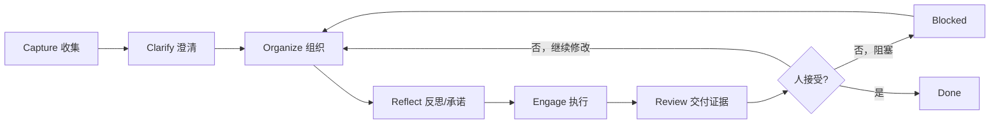
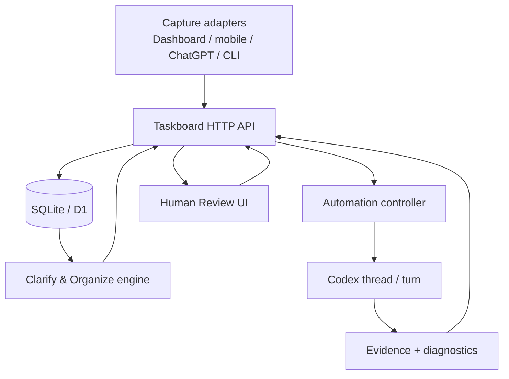

# GTD × AI Task Dashboard 设计引擎

> 版本：v1.0 设计提案 · 2026-10-06 · 关联 LOCAL-24
>
> 本轮交付设计和现状审计，不代表以下目标能力已上线。除第 2 节现状外，字段、接口、规则和路线均为拟议设计；未确认的策略不会自动写入运行配置。
>
> 目标：把 GTD 的收集、澄清、组织、反思、执行、复盘，落成一个人机责任清晰、可观察、可恢复的 Task Dashboard。

## 1. 设计结论

Task Dashboard 的核心对象不是“待办列表”，而是一个**意图到结果的控制回路**：



系统的第一原则是：**人决定“为什么做、现在是否承诺、结果是否算完成”；AI 负责“怎么做、执行到哪、哪里出错、留下什么证据”。**

因此：

- `backlog` 是收集和保留，不代表授权。
- `todo` 是人已经准备好下一步，允许自动执行。
- `in_progress` 是执行责任已被明确绑定；启动中、执行中、连接未知要作为执行子状态展示，不能都显示“正在运行”。
- `in_review` 是 AI 已交付证据，等待人判断。
- `done` 只能由人明确接受。

## 2. 当前实现基线

核对基线：功能分支 `feat/local-24-gtd` 为 `99f48a1ecede0892829cbee497ceca6241f91ab4`；本地 main 与查询时的远端 main 为 `2223b034b712ce8a42cc2e479051d58b2be466e7`。`git ls-remote` 已确认功能分支在远端；旧记录中的“尚未推送”已过时。功能分支尚未合入本地 main；本轮未确认运行服务加载了功能分支，不能把分支代码等同于已上线能力。

代码审计现状：

| 能力 | 当前实现 | 证据 |
|---|---|---|
| 全量自动派发 | 一轮扫描全部可执行 `todo`，单任务失败不阻塞后续任务 | `scripts/taskboard-local-dispatch.mjs`、自动认领测试 |
| 独立执行上下文 | 每个任务保存独立 thread/project/host/workspace；旧 thread 失效时重建并记录原因 | `scripts/taskboard-local-dispatch.mjs` |
| 非阻塞执行 | `turn/start` 成功后立即继续派发，完成通知异步回写 | `scripts/codex-injector.mjs` |
| 错误可观察 | 部分终态失败写评论；派发前错误、未知结果、旧线程恢复主要进 diagnostics，双通道尚不完整 | `AutomationDiagnostics.tsx`、local dispatch |
| Review 回流 | `in_review` 评论提交后自动回 `todo`，按钮显示“评论并继续处理” | `TaskDetail.tsx` |
| 人工完成门禁 | 分支的 update/move 拒绝 agent；create 仍可直接建 done，actor 归因也不能证明人工确认 | `server/database.mjs`、`cloud/src/index.mjs` |
| Capture 留痕 | 分支保存两项元数据，通用添加默认 backlog；无唯一约束、无独立原文快照、未覆盖所有入口 | `shared/task-input.mjs`、数据库迁移、`App.tsx` |
| 运行恢复 | Codex CLI 路径修复、iframe heartbeat 受控恢复 | main 已合入提交 |

当前实现是“执行闭环”的基础，不等于完整产品。上一轮评论的测试数是历史回归结果，不能证明完整验收。本轮只做代码/文档审计和隔离数据库验证，没有再次运行完整测试，也没有启动真实 Codex 工作负载。

直接复现（临时 SQLite，结束后已清理，未修改真实任务库）：

| 操作 | 实际结果 | 结论 |
|---|---|---|
| 两次创建同一个 captureId | 得到两个不同 task ID | Capture 尚不幂等 |
| 更新 description | 当前正文变为新内容；只有 captureId/source 元数据 | 不能把可编辑正文当不可变 capture 原文；活动历史不能替代独立收集记录 |
| agent 调用 createTask(status=done) | 创建成功 | update/move 门禁未覆盖创建入口 |

其他代码证据：`App.saveEditor` 每次调用都会新生成 captureId；`TaskDetail.submitComment` 先写评论再改状态，两次请求无原子性；`completeTurn` 无 finalText 时使用“自动执行完成。”仍可进入 in_review；已有 binding 的比较以本轮项目配置为基准，尚不能证明逐任务目标正确或旧会话不活跃。

风险分级：capture 重复和原文丢失为 HIGH；错误执行上下文、重复执行与伪人工完成为 HIGH。GitNexus 确认 `runLocalTaskboardAutomation → dispatchLocalTodos` 调用链；上述具体缺口以源文件和复现为准。

## 3. 人机责任模型

### 3.1 人负责的决定

人必须保留以下权力：

1. 这条输入是否值得保留。
2. 它是项目、单步行动、资料、等待事项还是 Someday/Maybe。
3. 是否存在明确下一步。
4. 是否承诺近期执行并置为 `todo`。
5. 优先级、截止时间、依赖和资源约束。
6. AI 交付是否满足目标。
7. 是否接受完成、要求继续、阻塞或取消。

### 3.2 AI 可以自动做的事

AI 可以在授权范围内：

- 建议标题、下一步、项目、标签、优先级和依赖。
- 将原始输入结构化为草稿，但必须标记为 `suggested`，不能伪装成 `confirmed`。
- 读取已授权的任务上下文和附件。
- 创建/恢复独立执行 thread，运行命令和修改工作区。
- 写入进度、执行结果、验证证据、错误和风险。
- 将已交付任务移动到 `in_review`。
- 根据人的 Review 反馈继续执行。

AI 不得自动完成：

- 把 `backlog` 或材料收集项变为 `in_progress`。
- 把建议直接写成用户确认。
- 因 turn completed、提交成功或测试通过而进入 `done`。
- 清除其他会话的 binding、抢占 `in_progress` 任务或静默覆盖版本冲突。

## 4. 状态与不变量

| 状态 | 含义 | 进入条件 | 允许的自动动作 | 人的动作 |
|---|---|---|---|---|
| `backlog` | 已收集但未承诺 | 新建默认状态或主动退回 | 建议澄清，不执行 | 澄清、拆分、置 `todo` |
| `todo` | 已有明确下一步 | 人确认可执行 | 认领、派发、记录错误 | 修改、暂停、补依赖 |
| `in_progress` | 有明确执行者 | 已占有执行权且至少 thread/start 已接受；展示 starting/running 区别 | 进度记录、错误暴露 | 观察、停止、改范围 |
| `in_review` | 结果与证据已交付 | AI 完成并写入证据 | 等待反馈，不自动 done | 接受、继续、退回、阻塞 |
| `blocked` | 当前无法继续 | 依赖、API、连接或外部条件阻塞 | 展示原因，不盲重试 | 补条件、改计划、恢复 |
| `done` | 人明确接受 | Review 接受动作 | 只读保留证据 | 可重新打开并说明原因 |

必须保持的不变量：

- 一个任务最多有一个当前执行者。
- 一个任务的 `threadBinding` 必须是五字段完整绑定：thread、project、kind、host、workspace。
- 所有状态写回使用最新 `version`；冲突必须暴露。
- `done` 必须存在 Review 证据和用户确认时间。
- `in_review` 不因超时、自动化结束或下一轮扫描而消失。

## 5. 五层产品流程

### L1 Capture：低阻力收集

入口：Dashboard、全局快捷键、手机/ChatGPT、CLI、未来的 Raycast/系统分享。

写入契约：

```json
{
  "title": "原始标题或自动生成标题",
  "description": "原始内容，保留原文",
  "status": "backlog",
  "captureId": "客户端生成的幂等 ID",
  "captureSource": "dashboard|mobile|chatgpt|cli|shortcut",
  "capturedAt": "服务端时间",
  "attachments": [],
  "actor": "user"
}
```

设计要求：

- `captureId` 唯一；重复提交返回原任务，不重复建卡。
- 服务端时间是审计时间，客户端时间只作为辅助元数据。
- 附件上传失败必须显示“任务已创建、附件未完成”，提供重试，不重复建任务。
- 收集失败必须返回稳定错误码、失败阶段和重试建议。
- 收集入口不能直接赋予执行授权。

当前缺口：本地/cloud 需要增加 `captureId` 唯一索引和重复提交语义；目前字段已保存，但跨入口幂等查询还未完成。

### L2 Clarify & Organize：澄清和组织

提供“整理工作台”，按批次处理 backlog：

1. 这是可行动事项吗？不是则归为资料、Someday/Maybe、参考或归档。
2. 如果可行动，期望结果是什么？
3. 下一步物理动作是什么？
4. 是否需要项目？项目是否有完成定义？
5. 是否有依赖、截止、上下文或能量要求？
6. 是否由人确认进入 `todo`？

AI 输出必须分成两栏：

- **建议**：AI 推断的标题、下一步、标签、项目、依赖、优先级。
- **已确认**：用户主动接受的字段，记录确认者和确认时间。

建议状态模型：

```text
suggested -> accepted -> applied
suggested -> rejected
```

没有下一步、依赖未满足或等待用户选择时，界面显示明确原因：

- `MISSING_NEXT_ACTION`
- `DEPENDENCY_NOT_DONE`
- `NEEDS_USER_DECISION`
- `CAPTURE_ONLY`

AI 可以帮助澄清，但不能通过语义判断绕过人的确认。

### L3 Reflect & Plan：反思和承诺

Dashboard 每日提供一个“承诺面板”：

- 今日最重要的 1 件必赢事项。
- 2 件加赢事项。
- 已承诺但未开始的 `todo`。
- 即将过期和长期阻塞项。
- 当前自动化运行健康度。

人可以一次性选择今天承诺的任务；系统只把明确承诺的事项置为 `todo`。时间块、日历和能量模型属于后续集成，不作为自动执行的隐式授权。

### L4 Engage：并行执行

自动化启动后：

1. 立即读取全部 `todo`。
2. 过滤归档项和未完成依赖。
3. 对每条任务读取最新任务、评论和附件。
4. 校验 binding 和版本。
5. 创建或恢复独立 thread。
6. `thread/start`/`turn/start` 成功后立刻写 `in_progress` 并继续下一条。
7. 完成后写结构化证据，再移到 `in_review`。

错误策略：

- API/CDP/Codex 错误：任务评论 + Dashboard diagnostics。
- 状态写回冲突：保留真实状态，记录冲突版本，不猜测重写。
- 连接超时：不得据此判定 thread stale；下一轮重试前保留 binding。
- 明确 NOT_FOUND/CLOSED：记录旧 thread 失效原因，再创建新 thread。
- 任务已被其他会话认领：跳过并显示 owner，不抢占。

### L5 Review & Evolve：Review 与进化

Review 卡片必须包含：

- 变更摘要。
- 运行命令和验证结果。
- 相关提交、文件和 thread。
- 未解决风险。
- 建议的下一步。
- 证据时间和执行者。

Review 动作：

| 动作 | 结果 |
|---|---|
| 接受完成 | `in_review → done`，写入用户、时间、Review ID |
| 评论并继续 | 写评论，`in_review → todo` |
| 退回整理 | `in_review → backlog`，要求补充意图或范围 |
| 阻塞 | `in_review → blocked`，必须填写原因 |
| 取消 | `in_review → canceled`，必须填写原因 |

当前已实现“评论并继续”的最小路径；接受、退回、阻塞、取消仍主要依赖通用状态动作，下一阶段应改成显式 Review 操作并统一证据格式。

## 6. 数据模型

### Task

```text
Task
├─ identity: id, identifier, title, description
├─ workflow: status, priority, labels, version
├─ capture: captureId, captureSource, capturedAt, attachments
├─ organize: nextAction, project, dependencies, suggestions, confirmations
├─ execution: threadBinding, executionOwner, startedAt, lastHeartbeat
├─ delivery: evidence, verification, risks, deliveredAt
└─ completion: acceptedBy, acceptedAt, reviewId
```

### Comment / Evidence

评论适合人机对话和错误记录；Evidence 适合机器可解析的交付证据。建议增加结构化 `evidence`：

```json
{
  "kind": "execution_result",
  "threadId": "...",
  "changedFiles": [],
  "commands": [],
  "checks": [{"name":"typecheck","status":"passed"}],
  "risks": [],
  "createdAt": "..."
}
```

这样 Dashboard 可以统计“交付但未 Review”“验证失败”“风险未关闭”，无需解析自然语言评论。

## 7. 系统架构



边界原则：

- API 是状态真相源。
- SQLite/D1 保存任务和审计数据，不把 active SQLite 放进 iCloud。
- Controller 是派发和恢复器，不负责替人决定完成。
- Codex thread 是执行上下文，不是任务状态真相。
- Dashboard 是观察和人工决策面。

## 8. 可观察性与恢复

每一轮自动化生成 `runId`，每个任务生成 `attemptId`。日志事件统一包含：

```text
run_started
candidate_scanned
candidate_waiting
thread_created
thread_resumed
thread_stale
turn_started
turn_accepted
turn_completed
turn_failed
writeback_succeeded
writeback_conflict
review_ready
review_feedback
human_accepted
```

Dashboard 提供三层诊断：

1. 项目层：本轮扫描数、启动数、Review 数、阻塞数、失败数、下一轮时间。
2. 任务层：当前状态、owner、thread、最后错误、修正建议。
3. 会话层：Codex host、workspace、thread/turn、heartbeat 和原始错误。

恢复原则：

- 可重试读操作可以有限重试。
- 不确定的写操作不得盲重放。
- 只有明确 stale 才重建 thread。
- 超过恢复阈值升级为人工阻塞，并保留全部上下文。

## 9. 安全和权限

定义三种授权：

- `capture`: 允许创建和保存原始输入。
- `organize`: 允许 AI 提议和用户确认结构化字段。
- `execute`: 允许 AI 在指定 project/host/workspace 执行。

危险操作额外要求：

- `danger-full-access` 必须逐轮确认或由明确的自动化策略授权。
- 任务 binding 不可被另一个会话静默替换。
- 任务和评论编辑使用对应对象版本；新建评论/证据使用请求幂等键，不假设现有 comment POST 已具备版本前置条件。
- 本地路径、凭据、Cookie、Token 不进入评论和设计文档。

## 10. 指标与 Review 节奏

核心指标：

- Capture → Clarify 平均停留时间。
- `backlog` → `todo` 转化率。
- `todo` → `in_progress` 启动成功率。
- 单轮全量派发完成率。
- `in_progress` → `in_review` 交付成功率。
- `in_review` → `done` 人工接受率。
- 版本冲突率、连接失败率、stale thread 重建率。
- Review 反馈后再次交付次数。
- 预估时间与实际时间偏差（未来时间追踪接入后）。

Review 节奏：

- 每日：承诺面板和阻塞项。
- 每周：清理 backlog、审查长期 `in_review`、复盘失败原因。
- 每月：审查自动化规则、权限、指标和 AI 建议采纳率。

## 11. 功能缺口与优先级

### P0：下一轮必须完成

1. Capture 幂等与原文快照：稳定客户端 ID、唯一约束、重复提交返回原任务；同 ID 不同内容返回冲突。
2. 显式 Review API：accept / continue / back-to-backlog / block，并结构化保存 Review 证据；覆盖 create/update/move 等全部 done 入口。
3. 任务评论与 Dashboard diagnostics 统一 `runId`、`attemptId`。
4. 自动化异常分类和修正建议标准化，避免同一错误在不同入口显示不同文本。
5. 收集失败重试按钮，附件失败可单独重试。
6. 执行 attempt 持久化、重启后的完成对账、目标与 owner 校验；移除“无交付证据也进 Review”。

### P1：形成可用的 GTD 工作台

1. Clarify inbox：批量澄清、建议与确认分栏。
2. `nextAction`、项目完成定义、依赖原因字段。
3. 今日承诺面板、1+2 规划和长期阻塞提醒。
4. Review 卡片结构化证据展示。
5. 本地文件/Obsidian/会话链接统一 Host Bridge 协议。

### P2：系统进化

1. 日历/时间块/能量模型。
2. 预估 vs 实际时间学习。
3. 跨设备 capture 同步和冲突解决。
4. Skill/SOP 进化建议。
5. 手机、Raycast、系统分享扩展。

## 12. 需要用户决定的事项

建议默认采用以下选项：

| 决策 | 推荐默认值 | 需要你确认的边界 |
|---|---|---|
| Capture 重复策略 | 相同 `captureId` 返回原任务 | 是否允许同一原文不同来源合并 |
| Review 反馈 | 发布反馈自动回 `todo` | 是否增加“反馈但保持 in_review” |
| Review 接受 | 仅用户身份、明确按钮 | 是否允许批量接受 |
| 组织确认 | AI 只提议，人点确认 | 是否允许你设定某些字段自动接受 |
| 自动化范围 | 只扫描 `todo` 且依赖完成 | 是否按优先级/能量限流 |
| 失败重试 | 读操作有限重试，写操作不盲重放 | 是否提供“人工确认后重试”按钮 |
| 时间追踪 | 后续 P2 | 是否需要现在先保存 startedAt/finishedAt |

上述为文档推荐值，不构成用户确认。已授权的 todo 自动执行继续按当前策略运行；需要改变授权范围、批量接受和数据归属的选项必须由用户选择后落地，不能因为用户暂未回复而自动采用。

## 13. 分阶段路线

### Phase 1：契约闭环

- 完成 capture 幂等。
- 显式 Review API 和结构化证据。
- 统一 run/attempt diagnostics。
- 补齐验收测试。

### Phase 2：澄清与每日规划

- Clarify inbox。
- nextAction、项目完成定义、依赖原因。
- 每日 1+2 承诺面板。

### Phase 3：入口与跨设备

- 手机/ChatGPT/Raycast capture adapter。
- iCloud 只同步事件/快照，不同步 active SQLite。
- 冲突可视化和人工合并。

### Phase 4：反思与进化

- 时间追踪、估算偏差、能量模型。
- Review 报表、Skill/SOP 建议。
- 自动化规则的月度 Review。

## 14. 验收矩阵

| 验收场景 | 预期 |
|---|---|
| 新建 capture | 原文、来源、时间、附件、captureId 可追溯；状态为 backlog |
| 重复 capture | 返回同一任务，不重复建卡 |
| backlog 扫描 | 不创建 thread，不进入 in_progress |
| 明确置 todo | 自动化立即扫描并可启动 thread |
| 多 todo | 一轮独立启动全部候选，单项失败不阻塞其他项 |
| 旧 thread | 只在明确 stale 时重建，原因可见 |
| 连接断开 | 任务不被误判完成，诊断保留并可恢复 |
| 完成 turn | 写交付证据并进入 in_review |
| Review 反馈 | 一键回 todo，反馈评论保留 |
| Review 接受 | 写确认人/时间/证据后进入 done |
| Agent 写 done | 409 + `TASK_REVIEW_REQUIRED`，任务状态不变 |
| 版本冲突 | 409 + 实际版本，禁止静默覆盖 |

## 15. 最终原则

Task Dashboard 的自动化程度越高，人的判断边界越要明确。系统的成功标准不是“AI 把任务做完”，而是：

1. 人可以低成本记录意图。
2. 系统能说明任务为什么还不能执行。
3. AI 被授权后能并行、可恢复、可观察地执行。
4. 每个结果都有证据。
5. 人能快速判断是否接受。
6. 所有错误都能被看见并继续处理。

这套设计把 GTD 从清单管理升级为**人定方向、AI 运行过程、人验收结果**的协作系统。

## 16. 设计推导与个人系统边界

### 16.1 第一原理扫描

最关键假设是：用户移动任务到 todo 表示“下一步已明确，可加入当前授权队列”。如果 todo 混入资料或未作决定的事项，再好的调度器也只会更快地执行错误任务。因此先把收集与承诺分开；执行器只读结构化条件，不再请模型判断历史措辞是否授权。

用三个模型约束设计：GTD 用来区分材料和行动；控制回路用来区分意图、执行反馈和人工接受；分布式系统中的幂等与乐观并发用来处理网络不确定性。它们的失效条件分别是 todo 失去承诺语义、把 turn 结束误当结果完成、外部 API 不支持幂等且响应丢失。

### 16.2 时间与系统边界检查

过去的评论是上下文；当前显式状态和本轮授权决定是否执行；未来跨设备恢复依赖 task ID 和执行记录，不能依赖某一台机器上的 thread 仍然存在。

子系统：Dashboard、数据库、调度器、Codex 各自可能失败。系统：任务状态不能随某个 UI 或 renderer 的生命周期消失。超系统：日历、提醒事项、Obsidian、Git 仓库有自己的事实来源，不应全塞进 Taskboard。

| 容器 | 负责的事实 | Taskboard 怎么关联 |
|---|---|---|
| 日历/提醒事项 | 固定时间、外部承诺、到点提醒 | 保存外部 ID/链接和同步状态；失败可见，不伪称已提醒 |
| 普通任务 | 已知下一步的执行 | Taskboard Task 是行动事实源 |
| 掌控感日志 | 认知不确定性、判断不清 | 关联“当前卡点/下一抓手/检查点”；由人确认掌控后关闭 |
| 项目笔记 | 长周期背景、决策、材料 | 链接项目 outcome 和原文，避免复制成多个真相源 |
| Taskboard Review | AI 结果、人是否接受 | Done 与“掌控感关闭”彼此独立 |

旧笔记曾建议 AI 自动分类甚至删除收集内容；本方案采用 LOCAL-24 的新边界：AI 可以提议，但不能伪造用户确认，不能自动删除原始 capture。沿用旧笔记的低阻力收集、延迟创建项目工作区、预估与实际分开记录；不沿用隐式授权和强制接管判断。

“两分钟规则”给人提供立即处理建议，不使 AI 自动获得执行权。Someday/Maybe 与资料可先作为 backlog 分类，不必新增执行状态。`canceled` 沿用现有枚举，表示不再做；archive 表示隐藏保留，二者不同。

## 17. Dashboard 信息架构和一次完整使用过程

默认视图按用户需要决定什么组织，保留现有看板作为另一视图：

```text
顶部：项目/设备范围 | 收集 | 自动执行 开/关 | 最近扫描与下一轮
今日：1 个必赢 + 2 个加赢（只显示用户选择，AI 推荐单独标记）
待整理：原始输入、来源、AI 建议、待回答的问题
待执行：下一步、优先级、依赖、可执行/等待原因
执行中：启动中/运行中/结果未知、最近证据、打开会话
等你 Review：目标与交付对照、验证、风险、接受/继续/阻塞
需要介入：明确问题、责任人、修正建议、重试/返回整理
历史：Done、取消、归档；保留决策和证据
```

每张卡首先显示“现在要我做什么”。普通界面不堆 host ID、trace ID；“查看诊断”展开后才显示。离线时显示数据时间和“尚未同步”，不使用“已收集”代表只留在客户端缓存。

例子：手机记录“下周讲清 Taskboard 自动执行为何卡住” → capture 回执给出 ID → AI 建议“复现一次故障并整理三个原因”，列为建议 → 人确认下一步与验收“可复现步骤、日志、修复建议”，选择今天必赢 → todo 在已开启自动化内立即唤醒扫描 → task 绑定工作区，进入 starting/running → AI 输出报告和验证链接 → 用户发“补充断网场景”并点击继续 → 第二个 attempt 回流 → 用户接受对应交付版本 → done。

未回答的产品取舍集中进“需要介入”，不让整个项目停在一句“等待认领”。一般评论可保持 in_review；明确点击“评论并继续”才产生执行回流。这个目标交互比现有“所有新 Review 评论都回流”更精确，需单独实现。

## 18. 引擎执行协议：从按钮到可恢复副作用

以下均为拟议契约，不是当前已支持的 HTTP 接口。

### 18.1 收集事务

客户端在输入草稿建立时生成 captureId，失败重试和应用重启后保持同一个 ID。请求带来源标识、原文、客户端时间、附件清单；服务端记录 receivedAt。独立 Capture 保存 rawText/rawTitle/sourceRef/contentHash，不随任务标题和 description 的组织修改而变化。

最小实现可在同一本地 SQLite 增加 captures 表，以 `(sourceNamespace, captureId)` 唯一；关联 taskId。一次事务创建 Capture 与默认 backlog Task。相同键、相同载荷返回既有 task；相同键、不同载荷返回 `CAPTURE_KEY_CONFLICT`，不覆盖原文。故意再次记录相同文字使用新 ID；跨来源合并只做建议，避免误去重。

附件分两步：先登记 attachmentClientId 和 pending，再上传并落盘为 ready。上传失败保留 capture 和待重试清单；只重试附件，不再建 task。附件不全的 capture 显示“材料未齐”，由人决定是否仍可整理为可执行动作。

现有 taskctl issue create 尚没有 capture 专用参数，需要扩展 CLI/adapter；手机/ChatGPT 入口也不能因为 captureSource 可填 mobile 就宣称已经接通。MVP 先提供同协议的本地快捷入口，移动端使用经认证的现有可达服务；仅 loopback 的服务不能被手机直接使用。

### 18.2 澄清与授权事务

建议字段放 Proposal，不写入 confirmed 字段。人可以直接填下一步，也可以选中 AI 建议后批量应用。应用操作携带 taskVersion 和 proposalVersion；冲突展示差异，AI 不替用户再次确认。

Ready 条件只检查已确认字段是否存在、依赖状态、当前任务类型、项目映射和执行策略。已有明确 todo 属于授权队列，不得在迁移时因新增 nextAction 字段为空而重新语义拦截：可标记“历史已就绪，建议补下一步”，或由人执行一次显式迁移。新 backlog 进入 todo 的整理界面要求用户确认下一步。

授权是“当前策略处于 enabled + 任务处于 todo + 结构化条件满足”。enabled 的持续范围和暂停时间写入策略版本；开启/恢复马上扫描。todo 新增、Review continue 和依赖完成可发去抖唤醒事件；定时扫描作为补偿。下一次定时从本轮扫描结束计时，不从某个 worker 结束计时。

### 18.3 派发与执行权

1. 获取本项目扫描锁；加载所有候选并逐项计算明确原因。优先级影响顺序，不隐藏其他候选。
2. 读取任务版本、依赖、已有 binding 和目标；为候选以条件写建立唯一 active attempt（starting），尚不把它显示成 running。
3. 锁定当前任务执行者。其他调度器冲突后仅诊断，不能取新 version 覆盖认领；同任务其他活跃会话也不能恢复发送。
4. 目标由任务已有完整绑定或明确项目映射确定。全局队列混合项目时必须逐任务解析，不把全局当前 workspace 当作所有任务的 cwd。不同 host/project 不能仅凭“与当前不匹配”认定失效。
5. 无 thread 才创建；thread/start 成功后存完整 binding 并置 in_progress/starting。恢复已有 thread 前核实目标与活动状态；明确 NOT_FOUND/CLOSED 才创建新 thread，并记录旧、新 binding、原因和时间。
6. turn/start 以 attempt 关联，接受后存 turnId，执行子状态变为 running；立刻继续其他候选。可并行发起有界数量的启动请求，绝不等待任何任务做完才扫描后续。
7. watcher 异步消费完成事件；事件去重。交付证据与 task 版本相符才写 in_review。

“一轮全部派发”指所有满足机械条件的候选获得一次处理机会；若共享同一可变工作区，使用 worktree 隔离或显式资源队列。资源冲突是可见机械原因；不得以含糊“需要等”停住整个项目。扫描锁与 attempt 唯一约束解决不同层级竞争，不能只有进程内 Promise 锁。

### 18.4 完成对账与错误策略

| 失败点 | 行为 | 对用户的可见信息 |
|---|---|---|
| thread/start 响应丢失 | attempt=unknown，先核对已有结果；不盲建第二个 | 启动结果未知、核对入口 |
| thread 成功但任务写回 409 | 不启动 turn；记录已创建 thread，等待冲突处理 | 实际版本、未开始业务执行 |
| turn/start 明确拒绝 | owned attempt=failed，可置 blocked | 真实错误码与修正建议 |
| turn/start 超时或 CDP 断开 | 保留执行权与 binding；对账，不当作业务失败 | 连接状态未知、最后确认时间 |
| worker completed 无交付内容 | 读取 thread/turn 补证；仍无证据则需要介入 | 未交付，不能宣称 Review ready |
| 已交付但 in_review 回写失败 | delivery 持久化，排入写回队列 | 结果已保存，状态同步失败 |
| 依赖未完成 | todo 保留，等待原因指向具体任务 | 依赖 ID、状态、修正动作 |
| 评论/诊断存储失败 | 写本地持久待补事件，恢复后补写 | 降级故障横幅；日志写入也失败时输出明确 stderr |
| injector 重启 | 读取 active attempts 和 delivered 未写回记录，向 Codex 对账 | 恢复中、上次进度 |

任务、评论和 diagnostics 不跨网络做大事务。本地数据库同一事务记录状态意图与待投递事件，后台发布到评论/UI。每个事件有 eventId，可补投且不重复刷屏；同一根因持续存在时更新 occurrenceCount/lastSeenAt，错误变化才新增事件。写回冲突需核对 owner、attempt、task 版本和 binding，不仅比较 threadId（同线程多轮不能互相覆盖）。

外部 Codex RPC 若不支持请求幂等键，无法承诺端到端 exactly-once；应实现本地单执行者、可对账的 at-most-one active attempt，以及未知结果不盲重试。明确把这个限制写进运行诊断。

### 18.5 Review 事务

拟议 `POST /api/tasks/:id/review` 接收 action、expectedVersion、deliveryId、requestId、feedback/reason；接受完成需要可信用户会话和明确接受动作。continue 需要反馈或明确“按原目标继续”；block 需要原因。API 在一次本地事务写 Review 决策、评论引用、状态和版本；重复 requestId 返回相同结果。

accept 只接受当前 delivery 的指定版本，保存 acceptedBy/acceptedAt、目标/验收快照、deliveryId、审阅证据。新的工作产生新 delivery，旧接受记录不删除。done 重新打开保留原接受历史并记录原因。

现有本地 actorFromRequest 对缺少用户头的请求默认本地用户，因此 `actor.type=user` 只是归因惯例，不是强鉴权或人工点击证明。需要区别 worker 凭据与用户会话；通用 create/update/move 必须共用完成约束，create 不允许 agent 绕过 done 校验。若用户通过 ChatGPT 说“接受”，需要可信的用户确认记录关联，而不是 AI 自己填写 acceptedBy。

## 19. 建议的数据与接口增量

优先在现有服务内增加模块和表，不拆微服务、不先引入消息平台。API 是业务入口，持久化数据库是事实源，Codex 是可替换执行器。

| 对象 | 最少新增字段 | 解决问题 |
|---|---|---|
| Capture | sourceNamespace、captureId、rawText、rawTitle、sourceRef、contentHash、receivedAt、taskId | 原文留存、跨入口幂等 |
| Proposal | proposedBy、fields、baseTaskVersion、state、confirmedBy/At | 建议与人的确认分离 |
| Task | nextAction、outcome、acceptanceCriteria、executorKind、readinessReasons | 澄清、人工/AI行动分流 |
| AutomationPolicy | enabledBy/At、pausedAt、version、projectScope、interval、resourceLimits | 授权范围、恢复依据 |
| ExecutionAttempt | attemptId、runId、taskId、taskVersion、owner、target、threadId、turnId、state、timestamps | 防抢占、重启恢复 |
| Delivery | deliveryId、attemptId、goalSnapshot、changes、checks、artifacts、risks、deliveredAt | Review 证据 |
| ReviewDecision | requestId、deliveryId、action、feedback、acceptedBy/At | 完成责任和幂等回流 |
| DiagnosticEvent | eventId、attemptId、stage、code、message、remediation、retryability、time | 评论/UI/日志一致 |

拟议接口与旧接口的关系：

- `POST /api/captures`：只收集；既有 `/api/tasks` 保留手工建任务功能，适配器逐步改走 capture 协议。
- `POST /api/tasks/:id/proposals` 与应用确认：AI 提议、用户确认，分开动作。
- `GET /api/tasks/:id/readiness`：纯计算机械原因，不做 LLM 判断。
- `POST /api/tasks/:id/review`：显式 review 原子写入；替代前端先 comment 再 PATCH 的回流链。
- `GET /api/tasks/:id/executions`：attempt 与 delivery 只读历史。
- automation 唤醒/诊断接口复用现有 host bridge，不绕过服务使用隐藏 UI 操作。

所有写请求稳定返回 requestId、实体 ID、version 和具体错误码；不得返回成功但业务状态未变化。内部异常需脱敏，文件链接仅按权限展示。

## 20. 开发切片、验收证据与上线门槛

| 切片 | 涉及位置（仓库相对路径） | 必须演示的主路径 |
|---|---|---|
| S1 收集可靠性 | App.tsx、TaskEditor、api.ts、task-input、database、taskctl | 同 ID 重试三次只有一条；编辑任务后仍能查看原文；附件失败单独重试 |
| S2 完成与反馈 | TaskDetail、server/app、database、task-input | 普通评论不重开；明确 continue 一次写回；agent create/update/move done 都拒绝；用户 accept 留证 |
| S3 可恢复派发 | taskboard-local-dispatch、codex-injector、数据库执行记录、诊断 UI | 首条 turn 永不完成仍启动其余任务；重启后对账；状态 409 不覆盖 owner |
| S4 GTD 整理台 | DashboardView、TaskDetail、Proposal/Task API | AI 建议未确认不执行；人确认 todo 唤醒扫描；缺依赖显示具体原因 |
| S5 入口扩展 | Capture adapters、手机/ChatGPT/快捷入口 | 真实外部入口可达、鉴权、离线回执、重复提交无重复任务 |

测试必须区分三层：纯逻辑测试验证规则；真实 Taskboard HTTP + Codex simulator 验证协议；隔离的真实 Codex/浏览器演示验证实际可用。现有 harness 的 simulator 和合成 renderer 不能当作第三层证据。首次立即运行/恢复、全量派发、重复扫描、活跃线程、跨项目目标、连接中断、状态冲突、空交付、Review 回流应各有针对性用例。

本轮验收：设计的七项 LOCAL-24 标准都有对应章节；现状与目标分开；三个关键缺口可复现；路径和状态记录可恢复。产品后续上线门槛：S1–S3 通过隔离真实链路演示，再按仓库工作流进行用户确认/必要审查/集成。不得用“设计文档完成”代表产品通过全部验收。

迁移顺序：备份并验证可恢复 → 新增 nullable 字段/表 → 部署新读写路径 → 对旧数据标记 legacy/unknown → UI 暴露迁移状态。不能把现有 description 回填成“原始 capture 真相”，不能给历史 done 编造确认人。回滚保留新增数据，不删除已收集记录。多设备另阶段设计 fencing/设备主控和冲突；iCloud 只传版本化快照或事件包，不同步正在写的 SQLite。

## 21. 需要用户配合：最小输入包

写文档不依赖以下答案，可以先 Review 设计。进入 S4/S5 前最有价值的是：

1. 给 5–10 条你实际会收集的内容，覆盖工作、生活、资料、模糊想法、等待别人；用来验证分类与下一步交互。
2. 选最常用收集入口的顺序：Dashboard、Raycast/系统快捷键、手机快捷指令、ChatGPT。推荐先 Dashboard + Mac 快捷入口，但尚未视为你确认。
3. 确认本工具是否同时管理“人亲自做”的任务。推荐区分 executorKind，让它们出现在今日面板却不进入 Codex 队列。
4. Review 推荐普通评论保持状态、明确“评论并继续”才回流；是否接受这个默认交互。
5. 确认日历/提醒事项继续作为固定时间事实源，Obsidian 承载项目材料与每日沉淀；若采用其它系统，只需给名称与希望的边界。

不需要提供 Token、Cookie 或完整私密数据。无须为已有 todo 的本轮执行重新授权。这些输入用于产品取舍，不作为历史语义等待门禁。

## 22. 参考与溯源

以下均为 Workspace 相对路径：

- `2-Areas领域范围/存档 2/任务管理自动化流程搭建/GTD与AI自动化系统设计.md`：低阻力收集、延迟物化、并行执行。
- `2-Areas领域范围/存档 2/任务管理自动化流程搭建/GTD_L1-L5精细化角色设定.md`：L1–L5 分层。
- `2-Areas领域范围/存档 2/任务管理自动化流程搭建/GTD_关于任务完成时间的深度思考.md`：估算/实际与认知负担；本方案不把 AI 墙钟时间当人的劳动时长。
- `1-Daily日志/掌控感日志/README.md`：认知不确定性问题池，与执行清单分工。
- `8-Code/dashi-taskboard-worktrees/local-24-gtd/scripts/taskboard-local-dispatch.mjs`：启动、恢复、异常、Review 写回。
- `8-Code/dashi-taskboard-worktrees/local-24-gtd/scripts/codex-injector.mjs`：立即运行、轮询、异步 watcher。
- `8-Code/dashi-taskboard-worktrees/local-24-gtd/server/database.mjs` 与 `server/app.mjs`（同仓库）：capture、完成门禁、actor 归因。
- `8-Code/dashi-taskboard-worktrees/local-24-gtd/web/src/components/TaskDetail.tsx` 与 `web/src/App.tsx`（同仓库）：评论回流和 capture ID 生成。
- `8-Code/dashi-taskboard-worktrees/local-24-gtd/docs/codex-harness.md`：测试真实程度边界。

文档主文件：`8-Code/dashi-taskboard-worktrees/local-24-gtd/docs/gtd-ai-task-dashboard-design.md`。每日沉淀包含全文副本和跨设备恢复信息；后续以仓库主文件维护规范，以每日沉淀保存当日版本快照。
